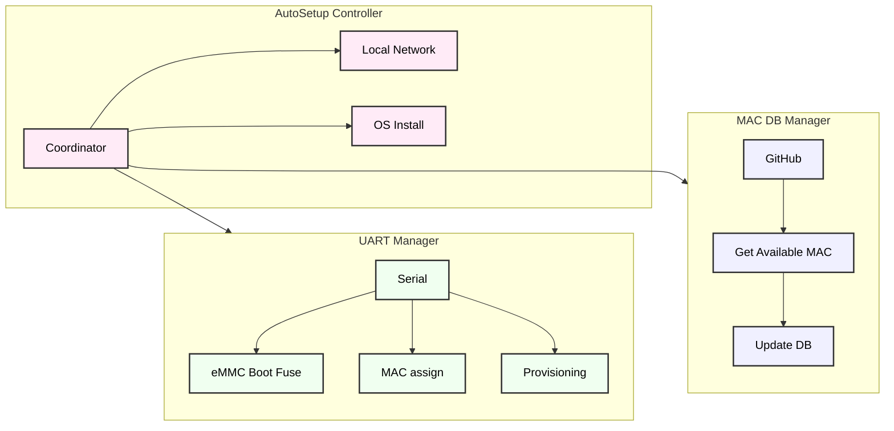
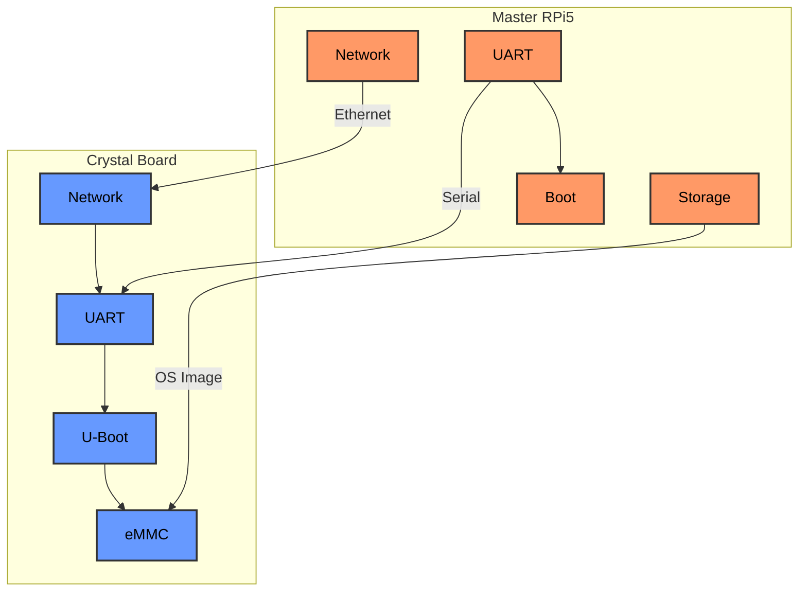

# Automatic Setup for Crystal Gateway

A comprehensive automation system designed for the industrialized initialization and configuration of Crystal gateway boards using a Raspberry Pi 5 as the master controller, integrated with a custom mechanical fixture and automated connection system. This automated production line approach combines software automation with mechanical precision to ensure reliable and repeatable board programming.

## Project Current Status

Current software implementation status of key features, 10/02 (95%):

- ✅ Board OS Installation
  - Complete OS image transfer and installation
  - Verified boot sequence
  - Successful system initialization

- ✅ MAC Address Management
  - MAC address fusing implementation
  - Database management with error handling
  - GitHub integration for tracking

- ✅ eMMC Boot Configuration
  - Boot sequence configuration using boot fuse
  - U-Boot environment setup
  - Verified boot from eMMC

- 🔄 Provisioning System
  - Implementation pending
  - Requirements analysis in progress
  - Integration planning phase

## System Architecture



## Hardware Overview




### Hardware Implementation


*Figure: Physical setup showing the complete fixture design with RPi 5 (Master) inside the fixture case connected to Crystal Board (Target) via UART, Ethernet and SD adapter. Note: The connections will be enstablished thanks to the linear cart.*


## System Components

### 1. AutoSetup Controller (Main Coordinator)
- Orchestrates the entire setup process
- Manages network configuration for both devices
- Handles file transfers and OS installation
- Coordinates between MAC database and UART operations

### 2. MAC Database Manager
- Manages MAC address allocation
- Handles GitHub repository interactions
- Processes pull requests for MAC assignments
- Maintains synchronization with central database

### 3. UART Communication Manager
- Manages serial communication with the board
- Handles boot sequence and interrupts
- Programs MAC addresses into hardware
- Configures U-Boot environment


## Process Flow

1. **Initialization Phase**
   - Load configurations
   - Verify hardware connections
   - Check file availability

2. **Network Setup**
   - Configure master network
   - Initialize UART connection
   - Setup target network
     
3. **OS Installation**
   - Transfer image files
   - Program eMMC
   - Configure system settings
   - Validate OS installation
     
4. **MAC Address Management**
   - Read board serial number
   - Check MAC availability
   - Create GitHub pull request
   - Program MAC to hardware

5. **Provisioning PENDING**

## Prerequisites

### Hardware Requirements
- Raspberry Pi 5 (Master Controller)
- Crystal Board (Target Device)
- Physical Connections:
  - UART Connection (3.3V TTL)
  - Ethernet Connection (Cat5e/Cat6)
  - Custom SD adapter
  - Power Supply (5V/3A for RPi, 12V/1A for Crystal)

### Software Requirements
```bash
# Python dependencies
pip install pyserial gitpython PyGithub

# GitHub CLI setup
gh auth login

# System packages
sudo apt update
sudo apt install bmaptool
```

### Required Files Structure
```
project_root/
├── autosetup/
│   ├── autosetup.py        # Main coordinator
│   ├── mac_manager.py      # MAC database handler
│   └── uart_manager.py     # UART communication
├── config/
│   ├── network.yaml        # Network configuration
│   └── github.yaml         # GitHub credentials
├── images/
│   ├── os_image.wic.gz     # OS image
│   └── os_image.wic.bmap   # Block map
└── keys/
    └── vitrotv_root_rsa    # SSH key
```

## Configuration

### Network Configuration
```yaml
# config/network.yaml
master:
  ip: "192.168.2.1"
  interface: "eth0"
  netmask: "255.255.255.0"

target:
  ip: "192.168.2.2"
  interface: "eth0"
  netmask: "255.255.255.0"
```

### GitHub Integration
```bash
# Generate deployment key
ssh-keygen -t ed25519 -C "mac-db-automation" -f ~/.ssh/mac_db_key

# Configure SSH
cat >> ~/.ssh/config << EOL
Host github.com-mac-db
    HostName github.com
    User git
    IdentityFile ~/.ssh/mac_db_key
EOL
```

## Usage
Note: The final version will be completely automated and the whole system will start the setup procedure simply by pressing an external push-button.

### Basic Usage
```bash
python autosetup.py --config config/setup.yaml
```

### Advanced Options
```bash
python autosetup.py \
  --config config/setup.yaml \
  --github-token YOUR_TOKEN \
  --repo-url git@github.com-mac-db:org/mac-db.git \
  --skip-os-install \
  --verbose
```


## Error Handling

### Network Issues
- Connection timeouts
- IP address conflicts
- Interface configuration failures

### MAC Assignment Failures
- Database synchronization errors
- GitHub API issues
- Hardware programming failures

### OS Installation Problems
- Transfer interruptions
- eMMC programming failures
- Boot configuration errors

## Troubleshooting Guide

### Network Configuration
```bash
# Check interface status
ip addr show eth0

# Test connectivity
ping -c 3 192.168.2.2

# Reset interface
sudo ip link set eth0 down
sudo ip link set eth0 up
```

### UART Communication
```bash
# Verify device
ls -l /dev/ttyAMA0

# Test serial connection
screen /dev/ttyAMA0 115200

# Check permissions
sudo usermod -a -G dialout $USER
```

### MAC Database
```bash
# Test GitHub access
ssh -T git@github.com-mac-db

# Verify database
git clone git@github.com-mac-db:org/mac-db.git
cat mac-db/db.csv
```

## Contributing

1. Fork the repository
2. Create your feature branch
3. Commit your changes
4. Push to the branch
5. Create a Pull Request

## License

This project is licensed under the MIT License - see the LICENSE file for details.

## Acknowledgments

- NXP i.MX6 Development Team
- Raspberry Pi Foundation
- GitHub API Contributors
